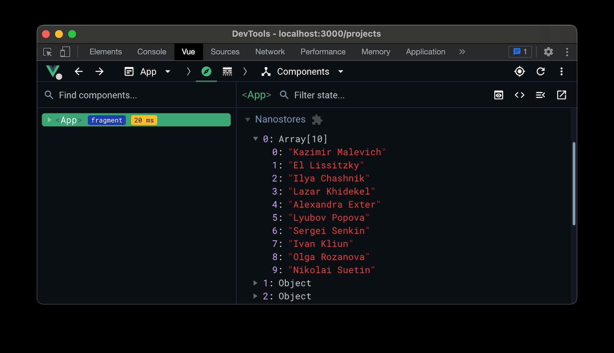

# Nano Stores Vue


Vue integration for **[Nano Stores]**, a tiny state manager
with many atomic tree-shakable stores.

* **Small.** Less than 1 KB with all helpers. Zero dependencies.
* **Fast.** With small atomic and derived stores, you do not need to call
  the selector function for all components on every store change.
* **Tree Shakable.** The chunk contains only stores used by components
  in the chunk.
* **Helpers.** Designed to keep code clean and save a few keystrokes.
* **Devtools.** Plugin with full support of [Vue Devtools].
* Was designed to move logic from components to stores.
* It has good **TypeScript** support.

## Install

```sh
npm install @nanostores/vue
```

## Usage

### Store state

Subscribe to store changes and use reactive store state.

```vue
<template>
  <header>{{ post.title }} for {{ user.name }}</header>
</template>

<script>
  import { useStore } from '@nanostores/vue'
  import { profile } from '../stores/profile.js'
  import { Post } from '../stores/post.js'

  export default {
    setup (props) {
      const user = useStore(profile)
      const post = useStore(Post(props.postId))
      return { user, post }
    }
  }
</script>
```

### Multiple store states

Generate multiple store states and save a few keystrokes.

```vue
<template>
  <header>{{ project.name }} / {{ user.name }}</header>
</template>

<script>
  import { mapStores } from '@nanostores/vue'
  import { project } from '../stores/project.js'
  import { user } from '../stores/user.js'

  export default {
    setup () {
      return {
        ...mapStores({ project, user })
      }
    }
  }
</script>
```

### Form handling

Since the store state is deep read-only, you cannot directly mutate it.
But for `v-model` you can create model via `useVModel(store, keys, opts)`.
It will explicitly mutate the store via `store.set()` / `store.setKey()`.

```vue
<template>
  <input v-model="username"/>
</template>

<script>
  import { useVModel } from '@nanostores/vue'
  import { profile } from '../stores/profile.js'

  export default {
    setup () {
      const username = useVModel(profile, 'username')
      return { username }
    }
  }
</script>
```

The `keys` argument can be an array of keys to create multiple models.
Each model will be prefixed with `Model`. You can change it via `opts.prefix`.

```vue
<template>
  <input v-model="firstNameModel"/>
  <input v-model="lastNameModel"/>
</template>

<script>
  import { useVModel } from '@nanostores/vue'
  import { profile } from '../stores/profile.js'

  export default {
    setup () {
      return {
        ...useVModel(profile, ['firstName', 'lastName'])
      }
    }
  }
</script>
```

## Devtools

<p align="center">
  
</p>

### Install

```sh
npm install --save-dev @vue/devtools-api
```

### Usage

#### Store detector

Install **[Vue Devtools]** plugin as usual. It will detect nanostores
in selected component and add their states to the **component inspector**.

```js
import { createApp } from 'vue'
import { devtools } from '@nanostores/vue/devtools'

import { User } from '../stores/user.js'

const app = createApp(…)
app.use(devtools)
```

> Notice: if you are using SSR, there is no Vue Devtools on server.
> Check it’s a browser environment:
> ```js
> if (window) app.use(devtools)
> ```

Attach stores to add them to the **nanostores inspector**
and see their builds, lifecycles and changes on the **timeline**.

```js
import { createApp } from 'vue'
import { devtools, attachStores } from '@nanostores/vue/devtools'

import { User } from '../stores/user.js'

const app = createApp(…)
app.use(devtools)

attachStores(app, { User })
```

You can connect several stores in different places of your application
and set custom names to simplify the work with devtools.

```js
attachStores(app, {
  'Current User': User,
  Post
})
```

### Settings

The states of all detected stores in **component inspector** are updated
in real time. You can disable this in the the plugin settings
via the **Real-time update detected** property.

By default, we removes unmounted stores from **nanostores inspector**
to keep it clean. You can change this via the **Keep unmounted** property.

[Nano Stores]: https://github.com/nanostores/nanostores/
[Vue Devtools]: https://devtools.vuejs.org
